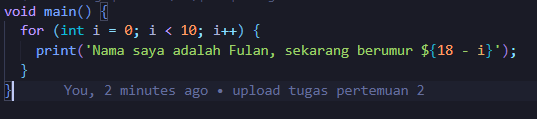

####Soal 1
Modifikasilah kode pada baris 3 di VS Code atau Editor Code favorit Anda berikut ini agar mendapatkan keluaran (output) sesuai yang diminta!

#####Jawab :

Kode :

Output : 

####Soal 2

Mengapa sangat penting untuk memahami bahasa pemrograman Dart sebelum kita menggunakan framework Flutter ? Jelaskan!

#####Jawab :

Memahami bahasa pemrograman Dart sebelum menggunakan Flutter sangat penting karena Flutter dibangun di atas bahasa Dart. Semua kode aplikasi Flutter ditulis dalam Dart, sehingga pemahaman yang baik tentang Dart adalah fundamental untuk dapat menulis dan memahami kode Flutter dengan efektif.

####Soal 3

Rangkumlah materi dari codelab ini menjadi poin-poin penting yang dapat Anda gunakan untuk membantu proses pengembangan aplikasi mobile menggunakan framework Flutter.

#####Jawab :

A. Dart
    Dart bertujuan untuk menggabungkan kelebihan-kelebihan dari sebagian besar bahasa tingkat tinggi dengan fitur-fitur bahasa pemrograman terkini, antara lain : 
        - Productive tooling 
        - Garbage collection 
        - Type annotations 
        - Statically typed 
        - Portability

B. Evolution of Dart
    Diluncurkan pada tahun 2011, Dart telah berkembang sejak saat itu. Dart merilis versi stabilnya pada tahun 2013, dengan perubahan besar termasuk dalam rilis Dart 2.0 menjelang akhir 2018.

C. How Dart Work
    Eksekusi pada dart dapat dilakukan dengan 2 cara yaitu Dart virtual machines (Vms) dan Javascript compiltions. Kode Dart dapat dieksekusi pada lingkungan yang mendukung bahasa Dart. Lingkungan tersebut terdapat fitur penting sebagai berikut : 
        - Runtime systems 
        - Dart core libraries 
        - Garbage collectors
    Eksekusi kode dart dapat beroperasi dalam 2 mode yaitu : 
        - Kompilasi JIT 
        - Kompilasi AOT

D. Structure of the Dart language 
    - Object orientation 
    - Dart operators 
    - Arithmetic operators 
    - Increment and decrement operators 
    - Equality and relational operators 
    - Logical operators

E. Hands-on with Dart 
    - DartPad
        Ini adalah kakas online yang bagus untuk belajar dan bereksperimen dengan fitur bahasa Dart. Kakas ini mendukung core library Dart, kecuali untuk library VM seperti dart:io. 
    - Main function
        Seperti kebanyakan bahasa modern, Dart menggunakan function dan method sebagai cara untuk memisahkan kode. Sebuah function atau method adalah potongan kode yang menerima beberapa data, eksekusi kode, dan kemudian mengembalikan beberapa data (return).

####Soal 4

Buatlah slide yang berisi penjelasan dan contoh eksekusi kode tentang perbedaan Null Safety dan Late variabel !

#####Jawab :

[Link Google Slide](https://drive.google.com/file/d/1OTc10LL-l1tJUQTkNl3E2QCXO_LuHHH-/view?usp=drive_link)