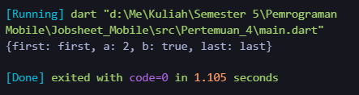
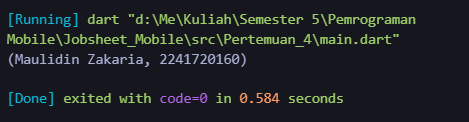

## Pemrograman Mobile - Pertemuan 4

| Nama  | Maulidin Zakaria |
| ----- | ---------------- |
| NIM   | 2241720160       |
| No    | 16               |
| Kelas | TI-3G            |

## Soal 1

Silakan selesaikan Praktikum 1 sampai 5, lalu dokumentasikan berupa screenshot hasil pekerjaan Anda beserta penjelasannya!

#### Jawab :

Praktikum 1 :

Kode :

Output :

Kode di atas merupakan sebuah program Dart sederhana yang menggunakan list, yang dikenal juga sebagai array dalam bahasa pemrograman lain. Fungsi assert() digunakan untuk memastikan bahwa ekspresi yang diberikan bernilai benar. assert(list.length == 3); memastikan bahwa panjang list adalah 3. assert(list[1] == 2); memastikan bahwa elemen pada indeks ke-1 (yang kedua) adalah 2. Jika salah satu asersi gagal (misalnya panjang list bukan 3, atau nilai pada indeks 1 bukan 2), program akan memberikan kesalahan dan berhenti berjalan.

Kode :

Output :

Kode tersebut membuat sebuah list berukuran 5 menggunakan List.filled(5, null) yang mengisi setiap elemen dengan nilai null. List ini bertipe List<dynamic>, sehingga dapat menampung berbagai tipe data. Pada indeks 1, nilai diubah menjadi "Maulidin Zakaria", dan pada indeks 2 diisi dengan angka 2241720160. Karena list dideklarasikan sebagai final, ukuran dan referensi list tidak bisa diubah, tetapi nilai di dalamnya dapat dimodifikasi.

Praktikum 2 :

Kode :

Output :

Kode tersebut mendefinisikan sebuah Set di Dart bernama halogens, yang berisi lima elemen string: 'fluorine', 'chlorine', 'bromine', 'iodine', dan 'astatine'. Set ini mencetak semua elemen yang ada di dalamnya, yaitu nama-nama unsur golongan halogen. Sebagai struktur data, Set memastikan bahwa setiap elemen unik dan tidak ada duplikasi.

Kode :

Output :

Kode tersebut mendefinisikan dua Set di Dart: names1 dan names2. names1 adalah Set bertipe String yang diinisialisasi dengan <> dan kemudian diisi dengan dua elemen: 'Maulidin Zakaria' dan '2241720160'. names2 adalah Set bertipe String yang diinisialisasi dengan literal {} dan diisi dengan elemen yang sama menggunakan metode addAll. Kode kemudian mencetak isi dari kedua Set, yang masing-masing menampilkan elemen 'Maulidin Zakaria' dan '2241720160'.

Praktikum 3 :

Kode :

Output :

Kode tersebut mendefinisikan dua buah Map di Dart: gifts dan nobleGases. gifts menggunakan string sebagai kunci (seperti 'first', 'second') dan mencampur tipe data nilainya, yaitu string ('partridge', 'turtledoves') dan integer (1). nobleGases menggunakan angka sebagai kunci (seperti 2, 10, 18), dengan nilai yang juga bervariasi antara string ('helium', 'neon') dan integer (2).

Kode :

Output :

Kode tersebut mendefinisikan dua Map bernama gifts dan nobleGases dengan tipe data String dan int yang berisi pasangan key-value untuk menyimpan informasi. Pada gifts, kunci dan nilainya adalah pasangan string, seperti 'first': 'partridge', dan properti lain seperti 'nama' dan 'nim' juga ditambahkan. Sedangkan nobleGases menggunakan kunci dinamis yang dapat berupa angka, seperti 2, dan ditambahkan data dengan nilai 'Maulidin Zakaria' dan '2241720160' untuk kunci-kunci numerik yang baru. Selanjutnya, dua Map lain, mhs1 dan mhs2, juga menyimpan nama dan NIM mahasiswa. Map mhs1 memiliki tipe kunci dan nilai berupa string, sementara mhs2 memiliki kunci dinamis dengan nilai string.

Praktikum 4 :

Kode :

Output :

Kode tersebut mendefinisikan dua variabel list dan list2. list berisi tiga elemen [1, 2, 3], sementara list2 berisi elemen [0] diikuti oleh elemen-elemen dari list menggunakan operator spread (...), yang menyalin semua elemen list ke list2. Ketika dicetak, list menghasilkan [1, 2, 3], sedangkan list2 menghasilkan [0, 1, 2, 3], dengan panjang list2 menjadi 4 karena memiliki satu elemen tambahan.

Kode :

Output :

Pada kode tersebut, list dideklarasikan sebagai tipe dinamis (dynamic) dan berisi tiga elemen [1, 2, 3]. Kemudian, list2 dibuat dengan menyebarkan elemen-elemen dari list menggunakan operator spread (...), sehingga list2 menjadi [0, 1, 2, 3]. Setelah itu, nilai list diubah menjadi [1, 2, null], dan hasilnya dicetak. Pada pembuatan list3, operator null-aware spread (...?) digunakan untuk menyebarkan elemen dari list, yang mengizinkan penyebaran list meskipun ada elemen null. Dengan ini, list3 menjadi [0, 1, 2, null], dan panjangnya (jumlah elemen) adalah 4. Kode ini menghindari error saat ada elemen null dalam list dengan menggunakan operator null-aware.

Kode :

Output :

Kode :

Output :

Kode tersebut menggunakan fitur collection if dalam Dart. Variabel promoActive memiliki nilai boolean. Kemudian, daftar nav berisi tiga elemen awal: 'Home', 'Furniture', dan 'Plants'. Pada bagian akhir list, terdapat kondisi if (promoActive) 'Outlet', yang berarti elemen 'Outlet' akan ditambahkan ke dalam list hanya jika nilai promoActive adalah true.

Kode :

Output :

Kode :

Output :

Kode tersebut menggunakan fitur pattern matching dengan pernyataan if untuk menambah elemen ke dalam list nav2. Variabel login diinisialisasi dengan nilai 'Manager'. List nav2 awalnya berisi tiga elemen: 'Home', 'Furniture', dan 'Plants'. Pada bagian akhir list, terdapat kondisi if (login case 'Manager') 'Inventory', yang berarti elemen 'Inventory' akan ditambahkan ke dalam list hanya jika variabel login memiliki nilai 'Manager'. Karena kondisi ini terpenuhi, 'Inventory' ditambahkan ke nav2, sehingga list tersebut berisi ['Home', 'Furniture', 'Plants', 'Inventory']. Hasilnya kemudian dicetak.

Kode :

Output :

Kode tersebut membuat sebuah list listOfInts yang berisi integer [1, 2, 3]. Kemudian, list kedua listOfStrings dibuat menggunakan list comprehension dengan menambahkan elemen '#0' sebagai elemen pertama, diikuti oleh hasil dari iterasi pada listOfInts. Pada setiap iterasi, elemen dari listOfInts dimasukkan ke dalam string '#i', yang kemudian menghasilkan list ['#0', '#1', '#2', '#3']. Pernyataan assert digunakan untuk memastikan bahwa elemen di indeks 1 dari listOfStrings adalah '#1', dan hasil akhir list tersebut dicetak.

Praktikum 5 :

Kode :

Output :

Kode tersebut mendefinisikan sebuah Map bernama record yang berisi pasangan key-value. Kunci (key) pada Map ini adalah 'first', 'a', 'b', dan 'last', sedangkan nilainya berturut-turut adalah 'first', 2, true, dan 'last'. Kemudian, print(record) akan mencetak isi dari Map tersebut dalam bentuk pasangan key-value, misalnya: {'first': 'first', 'a': 2, 'b': true, 'last': 'last'}. Map ini berguna untuk menyimpan data dengan asosiasi kunci dan nilai yang dapat diakses berdasarkan kunci tersebut.

Kode :

Output :

Kode tersebut mendefinisikan fungsi tukar yang menerima sebuah tuple berisi dua nilai integer (int, int) dan menukar posisinya. Di dalam fungsi, destructuring digunakan untuk memisahkan tuple record menjadi dua variabel, a dan b. Kemudian fungsi mengembalikan tuple baru dengan urutan yang dibalik, yaitu (b, a). Saat fungsi tukar dipanggil dengan tuple (1, 2), hasil yang dikembalikan adalah tuple (2, 1), yang kemudian dicetak oleh print(result).

Kode :

Output :

Kode tersebut mendeklarasikan sebuah variabel mahasiswa dengan tipe tuple (String, int) yang menyimpan dua elemen: sebuah String yang berisi 'Maulidin Zakaria' dan sebuah int dengan nilai 2241720160. Tuple ini adalah struktur data yang memungkinkan penyimpanan beberapa nilai dengan tipe yang berbeda dalam satu variabel. Setelah itu, variabel mahasiswa dicetak ke konsol, yang akan menampilkan tuple tersebut dalam bentuk (Maulidin Zakaria, 2241720160).

Kode :

Output :

Kode tersebut mendeklarasikan sebuah tuple bernama mahasiswa2 dengan kombinasi elemen yang terindeks dan diberi nama. Tuple ini berisi empat elemen: 'Maulidin Zakaria' sebagai elemen pertama yang bisa diakses dengan . $1, elemen bernama nim dengan nilai 2241720160, elemen bernama b dengan nilai true, dan elemen keempat 'last' yang bisa diakses dengan . $2. Kemudian, kode mencetak elemen-elemen dari tuple ini: elemen pertama ('Maulidin Zakaria'), nilai nim (2241720160), nilai b (true), dan elemen kedua ('last'). Tuple ini memungkinkan akses ke elemen-elemen baik melalui indeks numerik maupun nama label yang diberikan.

## Soal 2

Jelaskan yang dimaksud Functions dalam bahasa Dart!

#### Jawab :

Dalam bahasa Dart, functions adalah blok kode yang didefinisikan untuk melakukan tugas tertentu dan dapat dipanggil berulang kali dalam program. Fungsi dideklarasikan dengan tipe data pengembalian (atau void jika tidak mengembalikan nilai), nama, dan parameter opsional yang dapat digunakan di dalam tubuh fungsi. Dart mendukung fungsi anonim untuk penggunaan singkat dan juga memungkinkan fungsi diteruskan sebagai argumen ke fungsi lain, memfasilitasi callback dan operasi sejenis. Selain itu, fungsi dapat menjadi metode dalam kelas, memungkinkan operasi pada data objek. Dengan memanfaatkan fungsi, kode dapat lebih modular, terorganisir, dan mudah dipelihara.

## Soal 3

Jelaskan jenis-jenis parameter di Functions beserta contoh sintaksnya!

#### Jawab :

Di Dart, parameter dalam fungsi dapat dikelompokkan menjadi tiga jenis utama: positional parameters, named parameters, dan optional parameters. Berikut penjelasan dan contohnya:

1.  Positional Parameters Parameter ini adalah parameter standar yang didefinisikan dalam urutan tertentu. Ketika fungsi dipanggil, argumen harus sesuai dengan urutan parameter.

        void greet(String name, int age) {
          print('Hello, $name! You are $age years old.');
        }

        void main() {
          greet('Alice', 30);
        }

2.  Named Parameters Parameter ini ditandai dengan nama dan harus dikelilingi oleh kurung kurawal {}. Parameter ini bisa diisi dalam urutan apa pun ketika fungsi dipanggil.

        void greet({required String name, required int age}) {
            print('Hello, $name! You are $age years old.');
        }

        void main() {
            greet(name: 'Bob', age: 25);
        }

3.  Optional Parameters Parameter opsional bisa dideklarasikan dengan menggunakan kurung siku [] untuk positional optional parameters atau dengan nama untuk named optional parameters. Jika tidak disertakan dalam pemanggilan, parameter ini akan memiliki nilai default jika ditentukan.

    - Positional Optional Parameters:

            void greet(String name, [int age = 18]) {
                print('Hello, $name! You are $age years old.');
            }

            void main() {
                greet('Charlie');
                greet('Charlie', 22);
            }

    - Named Optional Parameters:

            void greet({String name = 'Guest', int age = 18}) {
                print('Hello, $name! You are $age years old.');
            }

            void main() {
                greet();
                greet(name: 'Dana');
                greet(age: 30);
                greet(name: 'Dana', age: 30);
            }

## Soal 4

Jelaskan maksud Functions sebagai first-class objects beserta contoh sintaknya!

#### Jawab :

Di Dart, fungsi dianggap sebagai first-class objects, yang berarti fungsi dapat diperlakukan seperti objek lainnya. Ini mencakup beberapa kemampuan utama:

1.  Menyimpan Fungsi dalam Variabel: Fungsi dapat disimpan dalam variabel seperti objek lainnya.
2.  Melewatkan Fungsi sebagai Argumen: Fungsi dapat diteruskan sebagai argumen ke fungsi lain.
3.  Mengembalikan Fungsi dari Fungsi Lain: Fungsi dapat dikembalikan sebagai hasil dari fungsi lain.
4.  Menyimpan Fungsi dalam Struktur Data: Fungsi dapat disimpan dalam koleksi seperti daftar (List) atau peta (Map).

        // 1. Menyimpan Fungsi dalam Variabel
        void greet(String name) {
            print('Hello, $name!');
        }

        void main() {
            var greetFunction = greet; // Menyimpan fungsi dalam variabel
            greetFunction('Alice');    // Memanggil fungsi melalui variabel
        }

        // 2. Melewatkan Fungsi sebagai Argumen
        void executeFunction(void Function(String) func, String value) {
            func(value); // Memanggil fungsi yang diteruskan sebagai argumen
        }

        void main() {
            executeFunction(greet, 'Bob'); // Menyediakan fungsi dan argumen
        }

        // 3. Mengembalikan Fungsi dari Fungsi Lain
        Function createMultiplier(int multiplier) {
            return (int value) => value * multiplier; // Mengembalikan fungsi
        }

        void main() {
            var doubleFunction = createMultiplier(2); // Mendapatkan fungsi pengganda
            print(doubleFunction(5)); // Output: 10
        }

        // 4. Menyimpan Fungsi dalam Struktur Data
        void main() {
            var functions = [
                (int x) => x + 1,
                (int x) => x * 2,
            ];

            for (var func in functions) {
                print(func(3)); // Output: 4 dan 6
            }
        }

## Soal 5

Apa itu Anonymous Functions? Jelaskan dan berikan contohnya!

#### Jawab :

Anonymous Functions, atau fungsi anonim, adalah fungsi yang didefinisikan tanpa nama. Fungsi ini sering digunakan untuk tugas-tugas sementara atau untuk penggunaan di tempat langsung di mana nama fungsi tidak diperlukan. Anonymous functions berguna dalam konteks di mana fungsi hanya dibutuhkan sekali atau untuk operasi sederhana.

Di Dart, anonymous functions sering disebut sebagai lambda expressions atau inline functions. Mereka dapat didefinisikan menggunakan sintaks khusus, dan dapat digunakan dalam berbagai konteks, seperti sebagai argumen untuk fungsi lain, dalam operasi koleksi, atau sebagai callback.

Contoh Sintaks Anonymous Functions

1.  Fungsi anonim sebagai argumen

        void main() {
            List<int> numbers = [1, 2, 3, 4, 5];

            // Menggunakan fungsi anonim dengan metode `forEach`
            numbers.forEach((number) {
                print(number * 2); // Mencetak dua kali lipat dari setiap angka
            });
        }

2.  Fungsi anonim dalam koleksi

        void main() {
            // Daftar fungsi anonim
            List<int Function(int)> functions = [
                (int x) => x + 1,
                (int x) => x * 2,
            ];

            for (var func in functions) {
                print(func(3)); // Output: 4 dan 6
            }
        }

3.  Fungsi anonim sebagai callback

        void main() {
            // Fungsi yang menerima callback
            void performOperation(int a, int b, int Function(int, int) operation) {
                print(operation(a, b));
            }

            // Menggunakan fungsi anonim sebagai callback
            performOperation(5, 3, (x, y) => x - y); // Output: 2
        }

## Soal 6

Jelaskan perbedaan Lexical scope dan Lexical closures! Berikan contohnya!

#### Jawab :

Lexical Scope dan Lexical Closures adalah konsep penting dalam pemrograman yang berkaitan dengan cara variabel dan fungsi diakses dalam konteks program.

1.  Lexical Scope

    Lexical Scope (atau Static Scope) merujuk pada cara variabel diakses berdasarkan lokasi di mana variabel tersebut dideklarasikan dalam kode. Dalam konteks lexical scope, lingkup atau jangkauan variabel ditentukan oleh struktur kode itu sendiri, bukan oleh bagaimana fungsi dipanggil.

        void main() {
            int outerVariable = 10; // Variabel luar

            void innerFunction() {
                print(outerVariable); // Mengakses variabel luar
            }

            innerFunction(); // Output: 10
        }

    Penjelasan :

    Dalam contoh di atas, innerFunction dapat mengakses outerVariable karena outerVariable dideklarasikan dalam lingkup yang lebih luas (di luar innerFunction). Ini adalah contoh dari lexical scope di mana akses ke variabel didasarkan pada lokasi deklarasi dalam kode.

2.  Lexical Closures

    Lexical Closures adalah konsep di mana sebuah fungsi "menutup" atau "menyimpan" lingkungan di mana fungsi tersebut dideklarasikan. Ini berarti bahwa fungsi tersebut dapat mengakses variabel yang berada di luar lingkup fungsi itu sendiri, bahkan setelah lingkup tersebut selesai dieksekusi.

        Function createCounter() {
            int count = 0; // Variabel yang akan di-"capture" oleh closure

            // Mengembalikan fungsi anonim yang "menyimpan" variabel count
            return () {
                count++;
                return count;
            };
        }

        void main() {
            var counter = createCounter(); // Membuat counter dengan closure

            print(counter()); // Output: 1
            print(counter()); // Output: 2
            print(counter()); // Output: 3
        }

    Penjelasan:

    Di contoh ini, fungsi createCounter mengembalikan fungsi anonim yang merupakan sebuah closure. Fungsi anonim ini memiliki akses ke variabel count yang dideklarasikan dalam createCounter, meskipun createCounter sudah selesai dieksekusi. Ini menunjukkan bagaimana lexical closure "menyimpan" lingkungan dari saat fungsi anonim diciptakan.

Lexical scope menjelaskan aturan akses variabel berdasarkan posisi kode, sedangkan lexical closures menjelaskan bagaimana fungsi dapat "menyimpan" dan mengakses variabel dari lingkup tempat fungsi itu diciptakan, memberikan kemampuan untuk mempertahankan status atau konteks dari variabel tersebut.

## Soal 7

Jelaskan dengan contoh cara membuat return multiple value di Functions!

#### Jawab :

1.  Menggunakan Tuple (Secara Eksplisit dengan List atau Map)

    - Contoh dengan list

            List<dynamic> getPersonInfo() {
                String name = 'Maulidin Zakaria';
                int age = 24;
                return [name, age];
            }

            void main() {
                var info = getPersonInfo();
                print('Name: ${info[0]}'); // Output: Name: Maulidin Zakaria
                print('Age: ${info[1]}');  // Output: Age: 24
            }

    - Contoh dengan map

            Map<String, dynamic> getPersonInfo() {
                return {
                    'name': 'Maulidin Zakaria',
                    'age': 24
                };
            }

            void main() {
                var info = getPersonInfo();
                print('Name: ${info['name']}'); // Output: Name: Maulidin Zakaria
                print('Age: ${info['age']}');   // Output: Age: 24
            }

2.  Menggunakan Kelas atau Objek (Encapsulation)

        class PersonInfo {
            final String name;
            final int age;

            PersonInfo(this.name, this.age);
        }

        PersonInfo getPersonInfo() {
            return PersonInfo('Maulidin Zakaria', 24);
        }

        void main() {
            var info = getPersonInfo();
            print('Name: ${info.name}'); // Output: Name: Maulidin Zakaria
            print('Age: ${info.age}');   // Output: Age: 24
        }

3.  Menggunakan Tuple dari Pustaka Eksternal

        import 'package:tuple/tuple.dart';

        Tuple2<String, int> getPersonInfo() {
            return Tuple2('Maulidin Zakaria', 24);
        }

        void main() {
            var info = getPersonInfo();
            print('Name: ${info.item1}'); // Output: Name: Maulidin Zakaria
            print('Age: ${info.item2}');  // Output: Age: 24
        }

## Soal 8

Kumpulkan berupa link commit repo GitHub pada tautan yang telah disediakan di grup Telegram!

#### Jawab :

[Link Github](https://github.com/MaulidinZakaria/16_MaulidinZakaria_JobsheetMobile)
