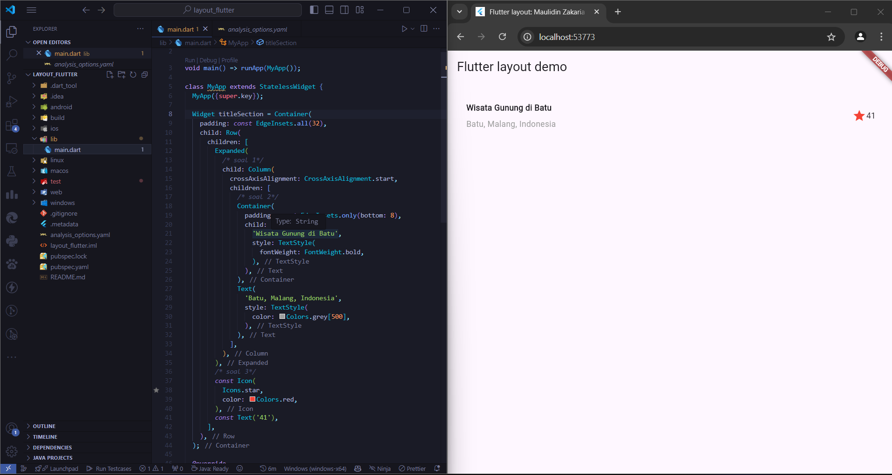

## Pemrograman Mobile - Pertemuan 6

| Nama  | Maulidin Zakaria |
| ----- | ---------------- |
| NIM   | 2241720160       |
| No    | 16               |
| Kelas | TI-3G            |

## Tugas Praktikum 1

## Soal 1

Selesaikan Praktikum 1 sampai 4, lalu dokumentasikan dan push ke repository Anda berupa screenshot setiap hasil pekerjaan beserta penjelasannya di file README.md!

#### Jawab :

Praktikum 1

Langkah 1 : Buat Project Flutter dengan cara memilih direktori dan mengetik flutter create nama_project di terminal

Langkah 2 : Modifikasi kode dalam class MyApp seperti dengan contoh yang ada di praktikum

Langkah 3 : Buat variabel yang digunakan untuk menyimpan widget title section, kemudian buat kode di dalamnya agar menampilkan seperti di praktikum

Praktikum 2

Langkah 1 : Buat function yang digunakan untuk mereturn atau membuat widget button yang disertai dengan label dan icon.

Langkah 2 : Kemudian buat variable color yang digunakan untuk menyimpan primary color, dan buat variabel widget buttonSection yang digunakan untuk memanggil fungsi button yang telah dibuat.

Praktikum 3

Langkah 1 : Buat variabel text section yang bertipe widget yang digunakan untuk menyimpan bagian text deskripsi yang panjang.

Langkah 2 : panggil widget tersebut ke dalam children dari column.

Praktikum 4

Langkah 1 : Tambahkan folder assets ke dalam file pubspec.yml.

Langkah 2 : Tambahkan gambar ke dalam body.

Langkah 3 : Ubah widget column menjadi ListView, hal ini digunakan untuk mendukung scroll yang dinamis.

## Soal 2

Silakan implementasikan di project baru "basic_layout_flutter" dengan mengakses sumber ini: https://docs.flutter.dev/codelabs/layout-basics

#### Jawab :

[basic_layout_flutter](https://docs.flutter.dev/ui/layout)

## Soal 3

Kumpulkan link commit repository GitHub Anda kepada dosen yang telah disepakati!

#### Jawab :

[Link Github](https://github.com/MaulidinZakaria/16_MaulidinZakaria_JobsheetMobile)

## Tugas Praktikum 2

## Soal 1

Untuk melakukan pengiriman data ke halaman berikutnya, cukup menambahkan informasi arguments pada penggunaan Navigator. Perbarui kode pada bagian Navigator menjadi seperti berikut.

#### Jawab :

## Soal 2

Pembacaan nilai yang dikirimkan pada halaman sebelumnya dapat dilakukan menggunakan ModalRoute. Tambahkan kode berikut pada blok fungsi build dalam halaman ItemPage. Setelah nilai didapatkan, anda dapat menggunakannya seperti penggunaan variabel pada umumnya.

#### Jawab :

## Soal 3

Pada hasil akhir dari aplikasi belanja yang telah anda selesaikan, tambahkan atribut foto produk, stok, dan rating. Ubahlah tampilan menjadi GridView seperti di aplikasi marketplace pada umumnya.

#### Jawab :

## Soal 4

Silakan implementasikan Hero widget pada aplikasi belanja Anda dengan mempelajari dari sumber ini: https://docs.flutter.dev/cookbook/navigation/hero-animations

#### Jawab :

## Soal 5

Sesuaikan dan modifikasi tampilan sehingga menjadi aplikasi yang menarik. Selain itu, pecah widget menjadi kode yang lebih kecil. Tambahkan Nama dan NIM di footer aplikasi belanja Anda.

#### Jawab :

## Soal 6

Selesaikan Praktikum 5: Navigasi dan Rute tersebut. Cobalah modifikasi menggunakan plugin go_router, lalu dokumentasikan dan push ke repository Anda berupa screenshot setiap hasil pekerjaan beserta penjelasannya di file README.md. Kumpulkan link commit repository GitHub Anda kepada dosen yang telah disepakati!

#### Jawab :

Langkah 1 : Tambahkan plugin go_router ke dalam file pubspec.yaml

Langkah 2 : Modifikasi kode pada fungsi main agar seperti kode di bawah ini, dan buat variabel _router yang digunakan untuk mendefinisikan route dari plugin go_router

Langkah 3 : Tambahkan kode di bawah ini untuk dapat pindah halaman dari halaman home ke halaman item serta dapat digunakan untuk membawa argument yang dapat disimpan pada variabel extra.

Langkah 4 : Tambahkan kode di bawah ini untuk dapat membaca atau menggunakan data argument yang dikirimkan sebelumnya.

