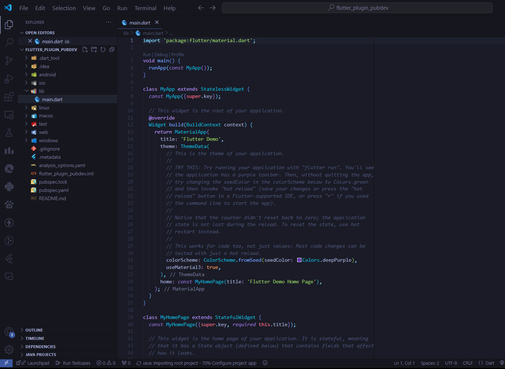
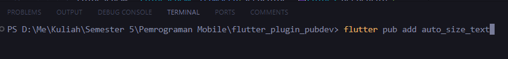
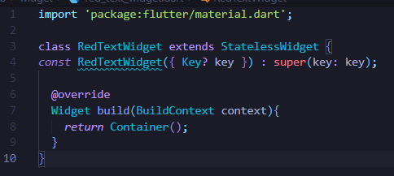
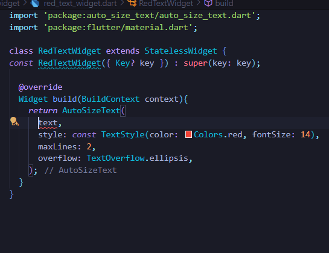

## Pemrograman Mobile - Pertemuan 7

| Nama  | Maulidin Zakaria |
| ----- | ---------------- |
| NIM   | 2241720160       |
| No    | 16               |
| Kelas | TI-3G            |

## Tugas Praktikum 1

## Soal 1

Selesaikan Praktikum tersebut, lalu dokumentasikan dan push ke repository Anda berupa screenshot hasil pekerjaan beserta penjelasannya di file README.md!

#### Jawab :

Praktikum Menerapkan Plugin

Langkah 1 : Buat Project Flutter dengan cara memilih direktori dan mengetik flutter create nama_project di terminal

Langkah 2 : Menambahkan plugin auto_size_text melalui terminal

Langkah 3 : Membuat file red_text_widget.dart untuk membuat widget yang nantinya akan ditambahkan plugin auto_size_text

Langkah 4 : Tambahkan kode yang sudah ada pada praktikum. Error? hal tersebut disebabkan karena tidak ada variable bernama text pada class tersebut.

Langkah 5 : Buat variable text dan parameter di constructor

Langkah 6 : Tambahkan widget yang telah dibuat di file main

## Soal 2

Jelaskan maksud dari langkah 2 pada praktikum tersebut!

#### Jawab :

Langkah 2 digunakan untuk menambahkan suatu plugin ke dalam project flutter melalui kode yang dijalankan di terminal. **flutter pub add nama_plugin**

## Soal 3

Jelaskan maksud dari langkah 5 pada praktikum tersebut!

#### Jawab :

Langkah 5 digunakan untuk menambahkan variable dan parameter text pada constructor agar ketika widget dipanggil maka value dari textnya dapat dinamis sesuai dengan isi dari parameternya.

## Soal 4

Pada langkah 6 terdapat dua widget yang ditambahkan, jelaskan fungsi dan perbedaannya!

#### Jawab :

Terdapat perbedaan pada ukuran textnya, hal tersebut disebabkan pada widget pertama menggunakan plugin auto_size_text yang dimana berfungsi untuk menyesuaikan ukuran text dengan ukuran parentnya. Sedangkan widget kedua ukurannya tidak berubah walaupun ukuran parentnya berubah.

## Soal 5

Jelaskan maksud dari tiap parameter yang ada di dalam plugin auto_size_text berdasarkan tautan pada dokumentasi ini !

#### Jawab :

1. text:

    - Ini adalah teks yang ingin ditampilkan. Sama seperti Text widget, ini adalah konten utama dari teks yang akan otomatis disesuaikan ukurannya.
    - Contoh: text: 'Hello World'

2. style:

    - Ini mengatur gaya teks, seperti warna, ketebalan font, ukuran font (batas ukuran awal), dan lain-lain. Parameter ini sama seperti yang ditemukan pada widget Text.
    - Contoh: style: TextStyle(fontSize: 40, color: Colors.blue)

3. maxLines:

    - Menentukan jumlah maksimal baris yang diperbolehkan untuk ditampilkan. Jika teks melebihi jumlah baris ini, akan dipotong.
    - Contoh: maxLines: 2

4. minFontSize:

    - Ukuran minimum yang diizinkan untuk font ketika menyesuaikan ukuran teks. Teks tidak akan mengecil di bawah ukuran ini.
    - Contoh: minFontSize: 12.0

5. maxFontSize:

    - Ukuran maksimal yang diizinkan untuk font. Ini membatasi ukuran teks agar tidak membesar lebih dari yang ditentukan.
    - Contoh: maxFontSize: 40.0

6. presetFontSizes:

    - Anda dapat menyediakan daftar ukuran font yang akan dicoba secara berurutan hingga teks sepenuhnya muat dalam area yang tersedia.
    - Contoh: presetFontSizes: [40, 30, 20]

7. stepGranularity:

    - Ini menentukan penurunan ukuran font dalam interval kecil untuk menyesuaikan teks. Nilainya menggambarkan langkah perubahan ukuran font saat mengurangi ukuran untuk menyesuaikan teks.
    - Contoh: stepGranularity: 1.0 (dalam ukuran font pixel)

8. overflowReplacement:

    - Sebuah widget alternatif yang ditampilkan jika teks tidak dapat diperkecil cukup untuk muat di dalam ruang yang disediakan.
    - Contoh: overflowReplacement: Text('Text too long')

9. wrapWords:

    - Menentukan apakah teks akan terpotong pada batas kata atau karakter saat menyesuaikan ukuran.
    - Contoh: wrapWords: false (jika false, kata tidak akan dibungkus)

10. textAlign:

    - Pengaturan ini menentukan bagaimana teks diatur secara horizontal dalam area yang tersedia.
    - Contoh: textAlign: TextAlign.center

11. overflow:

    - Ini menentukan bagaimana teks akan menangani overflow jika tidak muat di dalam batas yang disediakan, misalnya dengan elipsis (...).
    - Contoh: overflow: TextOverflow.ellipsis

12. softWrap:

    - Menentukan apakah teks boleh dibungkus ke baris baru jika melebihi ruang horisontal yang tersedia.
    - Contoh: softWrap: true

## Soal 6

Kumpulkan laporan praktikum Anda berupa link repository GitHub kepada dosen!

#### Jawab :

[Link Github](https://github.com/MaulidinZakaria/16_MaulidinZakaria_JobsheetMobile)

